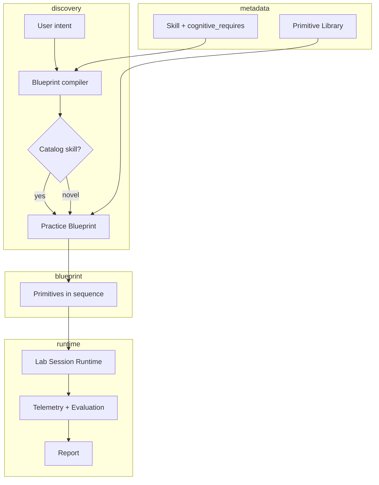
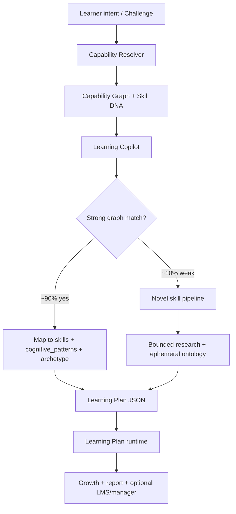
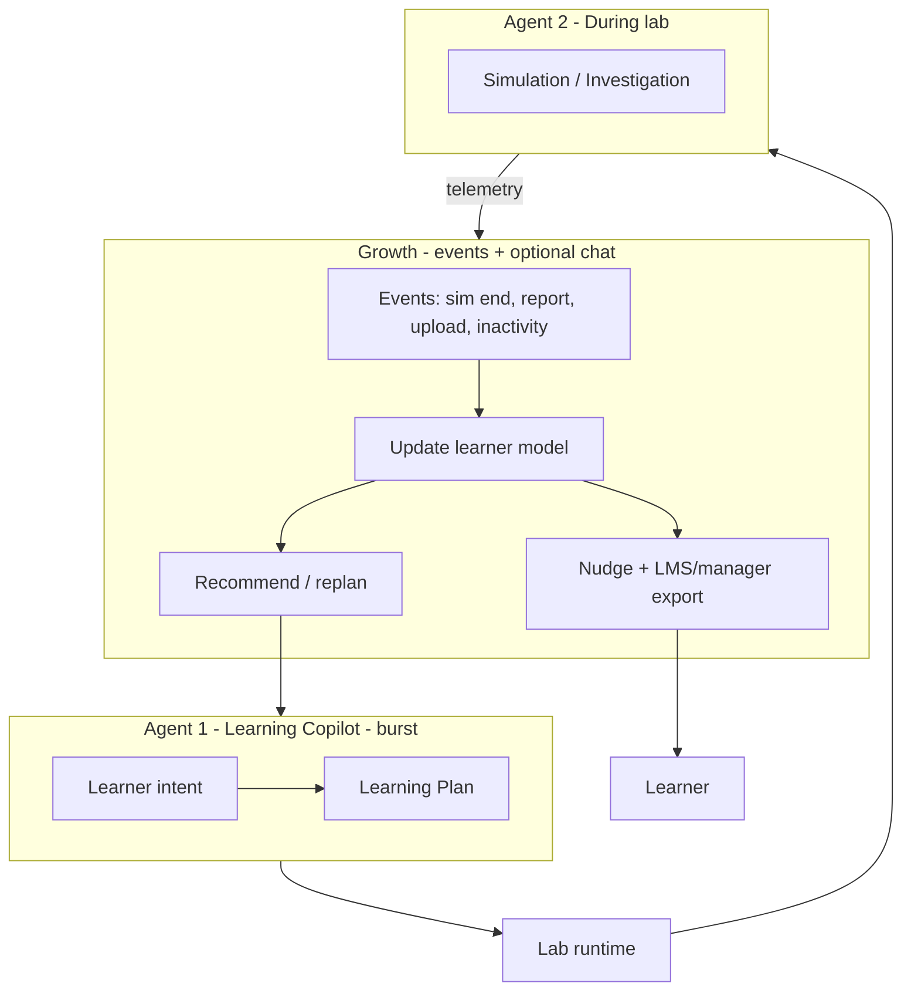
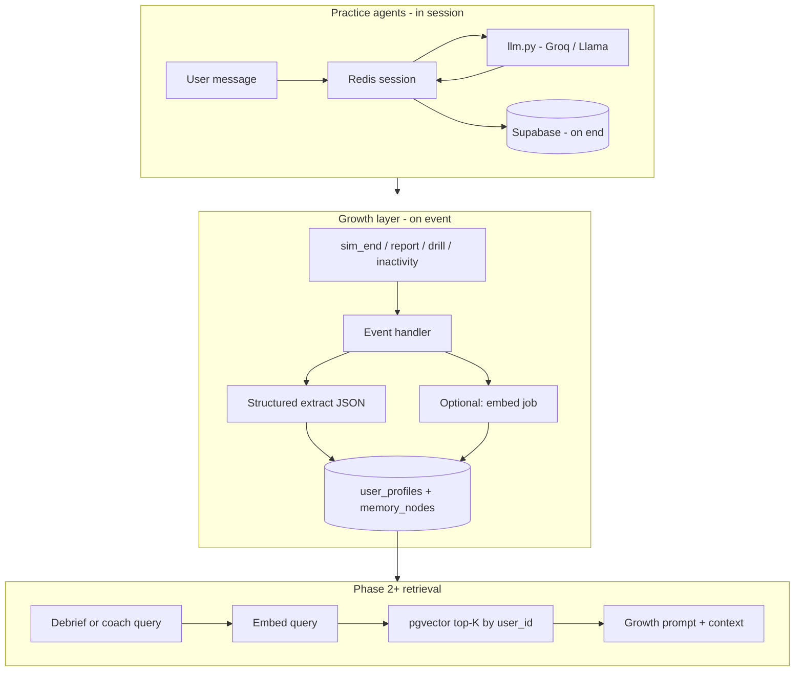
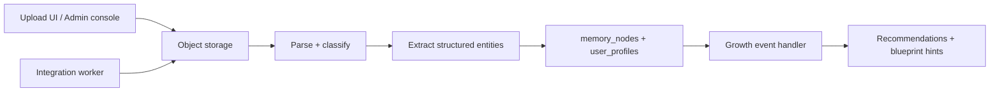

# Lumi6 Skill Lab — Product Direction & Future Plan

This document captures the strategic direction for Lumi6: where the product is today, where it is going, and how the pieces fit together. It consolidates architecture review, the Skill Lab Canvas Engine vision, agent vs non-agent boundaries, and the longitudinal Personal Growth layer.

---

## Executive summary

Lumi6 is evolving toward a **Human Capability Operating System**—not an LMS, coaching chatbot, or course platform, but measurable **behavioral transformation** driven by practice and evidence.

### Target flow (north star)

```text
User Challenge
        ↓
Capability Inference
        ↓
Capability Graph (+ Skill DNA)
        ↓
Archetype / Session Engine
        ↓
Learning Plan Runtime
        ↓
Practice Primitives
        ↓
Telemetry
        ↓
Human Development Graph
```

### Three product pillars

1. **Learning Plan runtime + primitives** — Composable practice blocks assembled into bespoke **Learning Plans** (practice blueprints executed in a lab shell; today’s archetype **sprints** are the live v1 of this).
2. **Learning Copilot (agent)** — Resolves intent + learner profile into a plan; **most goals map to the stable capability graph**; novel ontology only when truly necessary (~10%).
3. **Human Development Graph** — Longitudinal model, uploads, integrations, event-driven growth, org export. Answers *what interventions work for this person?*—not only *what skills do they have?*

**Moat hypothesis:** Simulations, content, and agents will commoditize. What is hard to copy is **years of behavioral evidence** + intervention effectiveness + contextual performance (Challenge Graph over time).

---


## Simplified vocabulary (use in docs & code)

Canonical glossary: **[docs/ARCHITECTURE.md](./docs/ARCHITECTURE.md)**. In roadmap text we prefer:

| Say | Not (unless historical) |
|-----|-------------------------|
| **Skill** | capability (as a noun for catalog item) |
| **Sprint** | skill lab session |
| **Archetype** | session engine (in user-facing copy) |
| **Stage** | primitive (for what exists today) |
| **Practice pattern** | Skill DNA, cognitive pattern (UI) |
| **Goal matching** | capability resolver |
| **Practice block** | primitive (for future composable engine) |
| **Custom plan** | learning plan, blueprint (future) |

Code layout: business logic in `src/domain/` (e.g. `goal-matching/`); catalog in `src/data/`; sprint UI in `src/app/.../sprint/`.

---

## Part 1: Current platform (baseline)

### What exists today

| Layer | Role | Key locations |
|--------|------|----------------|
| Taxonomy | ~15 skills, sub-skills, archetype + session engine | `src/data/skills-taxonomy.ts` |
| Archetype resolver | Maps archetype → stage flow, eval dimensions, prompts | `backend/app/ai/archetypes.py`, `src/types/index.ts` |
| Stage UI | One Next.js route per screen family | `src/app/.../sprint/[id]/(stages)/*` |
| Content AI | Generates primer, drills, scenarios, reasoning, reflection | `backend/app/routers/sprint_content.py` |
| Practice AI | Multi-turn simulation, evaluation, reports | `sprint_simulation.py`, `sprint_evaluation.py` |
| Discovery | “What do you want to learn?” → keyword match to catalog sprints | `src/components/dashboard/LearningComposer.tsx` |

### Archetypes (Phase 1)

Six archetypes group skills into practice formats:

| Archetype | Session engine | Stage flow (summary) | Status |
|-----------|----------------|----------------------|--------|
| **conversational** | `roleplay_engine` | Primer → drills → guided/independent sim → replay → reflection → escalated → report | **Live** |
| **analytical** | `reasoning_engine` | Primer → drills → reasoning workspace (3 modes) → reflection → assessment → report | **Live** |
| **reflective** | `reflection_engine` | Primer → guided reflection → patterns → growth plan → report | **Live** |
| **creation** | `creation_engine` | Primer → micro-skills → report | Stub |
| **performance** | `performance_engine` | Primer → micro-skills → report | Stub |
| **systems** | `systems_engine` | Primer → micro-skills → report | Stub |

**Design intent:** “100+ skills → 6 archetypes → 6 session engines.” Adding a skill = assign an archetype, not build a new engine.

**Limitation:** Many distinct cognitive skills (bias detection, root cause analysis, prioritization) share the **analytical** archetype and the same reasoning UI. Content varies via AI; **interaction pattern does not.**

### Implemented stage screens

| Screen | Route(s) | Archetypes |
|--------|----------|------------|
| Primer | `primer` | All |
| Micro-skills | `micro-skills` | All |
| Drills | `drills` | Conv., analytical, reflective |
| Guided / independent / escalated simulation | `simulation/*` | Conversational |
| Replay | `replay` | Conversational |
| Reflection | `reflection` | Conv. + analytical |
| Guided reflection | `guided-reflection` | Reflective |
| Reasoning workspace | `reasoning` | Analytical (assumptions, evidence, counterfactual) |
| Assessment | `assessment` | Analytical |
| Report | `report` | All |

The **reasoning page** is the best prototype for composable practice: one route, multiple modes, shared store (`useReasoningStore`), AI challenges per mode.

### Structural debt to address

1. **DB vs frontend mismatch** — Migrations define a fixed 11-stage `stage_type` enum; frontend uses archetype-specific flows. Sprint creation should insert stages from `get_stage_flow(archetype)`.
2. **Dual skill metadata** — DB has `learning_engine_type`; app uses `archetype` + `session_engine` in taxonomy (align via migration).
3. **Sprint identity** — URLs use slugs; context often resolves from taxonomy, not always DB sprint rows.
4. **Stages are pages, not blocks** — New interaction = new route + nav + prompts; not primitives in a lab shell.

### Schema already aligned with the future

- `user_profiles` — Learning genome (personality, strengths, weaknesses, scores) — `002_user_profiles.sql`
- `memory_nodes` — Typed longitudinal insights with embeddings — `007_memory.sql`
- `user_skill_mastery` — Per-skill mastery over time — `004_sprints.sql`

The **tables exist**; the **event pipeline that fills them** is the main gap.

---

## Part 1.5: Architecture review & refinements (May 2026)

External architecture review validated the overall direction. The items below are **adopted refinements**—adjustments before large-scale build-out.

### Verdict

The platform path is correct:

```text
User Challenge → Capability Inference → Personalized Learning Plan → Practice → Telemetry → Longitudinal Growth Model
```

If executed well, Lumi6 competes on **outcomes and evidence**, not content libraries.

### Refinement 1: Do not overuse novel ontology generation

**Risk of “novel ontology for every goal”:** inconsistent skill definitions, unstable benchmarking, expensive runtime generation, weak cross-user comparability, difficult org reporting.

**Policy:** Maintain a **stable capability graph**. Most learner goals resolve into **existing capabilities** (and shared **Skill DNA**—see below).

| Target split | Approach |
|--------------|----------|
| **~90%** | Resolve intent → existing capabilities in taxonomy / graph |
| **~10%** | Novel ontology pipeline (genuinely new domains only) |

**Example**

Input: *“I need to discuss GEO vs SEO budget allocation tomorrow.”*

Resolve to capabilities:

```text
Communication · Judgment · Strategic Thinking · Influence
```

—not a one-off “GEO vs SEO” skill tree.

The Copilot **assembles a Learning Plan** from primitives + profile; it does **not** mint a new global ontology unless the goal is a poor fit for the graph after inference.

### Refinement 2: Introduce Skill DNA

Skills and archetypes are not enough. Add **Skill DNA**—shared cognitive patterns and evaluation/telemetry dimensions that span skills.

```json
{
  "skill": "Critical Thinking",
  "archetype": "analytical",
  "cognitive_patterns": [
    "assumption_detection",
    "evidence_evaluation",
    "counterfactual_reasoning",
    "causal_analysis"
  ],
  "evaluation_dimensions": ["reasoning_quality", "evidence_quality"],
  "telemetry_dimensions": ["adaptability", "revision_speed"]
}
```

**Why:** Critical Thinking, First Principles, Decision Making, and Root Cause Analysis all depend on **assumption_detection** and **evidence_evaluation**. Track atomic patterns across skills for stronger personalization and benchmarking.

**Implementation note:** Extend taxonomy entries (or `skills` DB) with `cognitive_patterns[]`; blueprint compiler and growth layer read/write at pattern level, not only skill name.

### Refinement 3: Build a Challenge Graph (future moat)

Today: **Skill Graph** (mastery per skill).

Complement with **Challenge Graph**—workplace situations the learner cares about:

```text
Challenge → Skills required → User performance over time → Improvement
```

Example:

```text
Executive Presentation — Mar: 42 · Apr: 61 · May: 81
```

Organizations often care about **performance on challenges** more than abstract scores like `Communication = 76`. Link challenges to capabilities inferred from practice + manager context.

### Refinement 4: Reduce primitive complexity (v1 groups)

The full primitive library (12+ types) is the long-term target; **v1 should ship grouped primitives** to avoid blueprint explosion and authoring/eval overhead.

| Group | Primitives (v1) | Maps to later detail |
|-------|-----------------|----------------------|
| **Input** | Read, Watch, Listen | read + media variants |
| **Thinking** | Analyze, Decide, Reflect, Create | annotate, categorize, canvas, reasoning |
| **Practice** | Drill, Simulation, Investigation | existing engines + Q&A investigation |
| **Output** | Artifact, Report | artifact, review, feedback |

Expand granular types (annotate, prioritize, branching_scenario, etc.) when recipes and eval rubrics justify them.

### Refinement 5: Archetypes = session engines (keep scaling rule)

**100+ skills → 6 archetypes → 6 session engines** remains the scaling rule. Adding a skill should rarely require a new engine.

| Archetype | Example skills |
|-----------|----------------|
| **Conversational** | Negotiation, conflict resolution, stakeholder management, executive communication |
| **Analytical** | Critical thinking, decision making, first principles, problem solving |
| **Reflective** | Self-awareness, empathy, resilience, emotional regulation |
| **Systems** | Systems thinking, system design, process design |
| **Creation / Performance** | (stubs today; same engine pattern when live) |

### Refinement 6: Build order (runtime before Copilot)

Recommended sequence to reduce architectural risk:

| Phase | Build |
|-------|--------|
| **1** | Capability graph, Skill DNA, archetypes (align DB + taxonomy) |
| **2** | Learning Plan runtime, primitive engine, telemetry contract |
| **3** | Learning Copilot (catalog path first: resolve → plan) |
| **4** | Human Development Graph (events, observations, recommendations) |
| **5** | Novel goal pipeline (~10% path, guardrails, cost caps) |

See **Part 6** for updated roadmap numbering aligned to this order.

### Refinement 7: Human Development Graph = long-term moat

Simulations, content, and generic agents commoditize. Durable advantage:

```text
Years of behavioral evidence
+ Learning history
+ Intervention effectiveness
+ Contextual performance data (challenges, uploads, org signals)
```

Product question to optimize for: **What interventions work best for this person?**—not only **What skills do they have?**

### Refinement 8: Separate capability inference from learning delivery

Avoid: `Skill → Course`.

Prefer:

```text
Challenge → Capability Inference → Learning Plan → Practice → Feedback → Growth Model
```

**Capability inference** (resolver + graph + Skill DNA) is a distinct layer from **delivery** (runtime + primitives + session engines). The Copilot orchestrates both but should not collapse “what capabilities matter” into “what content to show” in one undifferentiated LLM call.

---

---

## Part 2: Vision — Skill Lab Canvas Engine

### Problem

Today: **Skill → Archetype → Fixed stage pages**

When someone wants bias detection, root cause analysis, product prioritization, systems thinking, or negotiation *planning*, we either force them into the nearest archetype or hand-build flows. **Not scalable.**

### Target

**Skill → Cognitive behaviors required → Best primitive sequence → Assembled practice**

A skill becomes metadata:

```json
{
  "skill": "Bias Detection",
  "archetype": "analytical",
  "cognitive_patterns": [
    "evidence_evaluation",
    "assumption_testing",
    "alternative_hypothesis_generation"
  ]
}
```

(`cognitive_patterns` = Skill DNA; shared across many skills—see Part 1.5.)

A **blueprint compiler** (rules + optional LLM for content) maps requirements to primitives. This is **not** a free-form learning agent.

### Learning primitives (Lego blocks)

**v1 grouped primitives** (ship first—see Part 1.5 Refinement 4):

| Group | v1 | Purpose |
|-------|-----|---------|
| Input | Read, Watch, Listen | Consume scenario artifacts |
| Thinking | Analyze, Decide, Reflect, Create | Structured cognition (maps to annotate, canvas, reasoning, etc.) |
| Practice | Drill, Simulation, Investigation | Deliberate practice + multi-turn agents where needed |
| Output | Artifact, Report | Produce work + debrief |

**Full primitive library** (expand as recipes and eval mature):

| # | Primitive | Purpose | Agent? |
|---|-----------|---------|--------|
| 1 | **Read** | Consume email, proposal, meeting notes, chat, dashboard, report | No — generate artifact once |
| 2 | **Annotate** | Highlight risks, assumptions, biases, contradictions | No — UI + rubric eval |
| 3 | **Categorize** | Drag-and-drop into buckets (fact / assumption / opinion) | No |
| 4 | **Prioritize** | Rank items (e.g. customer requests) | No |
| 5 | **Decision** | Choose strategy + explain why | No |
| 6 | **Canvas** | Whiteboard: sticky notes, links, frameworks | No (MVP); optional AI suggestions later |
| 7 | **Branching scenario** | Choices change scenario state | State machine + content |
| 8 | **Investigation** | User asks questions; system reveals facts gradually | **Yes** |
| 9 | **Simulation** | Multi-turn roleplay (existing engine) | **Yes** |
| 10 | **Artifact** | User creates email, memo, roadmap | No — create + eval |
| 11 | **Review** | Evaluate someone else’s work | No — rubric eval |
| 12 | **Feedback** | Structured debrief | Mostly no; optional Socratic coach |

### Example blueprints

**Bias detection**

```
Read (proposal) → Annotate (biases) → Decision (recommendation) → Feedback
```

**Product prioritization**

```
Read (customer requests) → Prioritize (board) → Artifact (decision memo) → Feedback
```

**Root cause analysis**

```
Read (incident report) → Investigation → Canvas (cause map) → Decision
```

**Negotiation**

```
Read (briefing docs) → Canvas (strategy) → Simulation → Feedback
```

### Target architecture



### Core data model (conceptual)

```typescript
interface SkillDefinition {
  name: string
  archetype: SkillArchetype          // default engine family
  cognitive_requires: string[]
  default_blueprint_id?: string
}

interface PracticeBlueprint {
  id: string
  skill_id?: string
  title: string
  steps: PracticeStep[]
}

interface PracticeStep {
  primitive: PrimitiveType
  config: Record<string, unknown>   // JSON schema per primitive
  content_ref?: string
}

type PrimitiveType =
  // Comprehension & structure
  | 'primer' | 'micro_skills' | 'read' | 'flashcard' | 'quick_sprint'
  // Practice & cognition
  | 'micro_drill' | 'annotate' | 'categorize' | 'prioritize' | 'decision'
  | 'reasoning' | 'canvas' | 'branching_scenario' | 'investigation'
  // Dialogue & output
  | 'simulation' | 'reflection' | 'artifact' | 'review' | 'feedback' | 'report'
```

**Legacy stages map to primitives:** today’s primer, micro-skills, drills, simulation, reasoning, reflection, and report become **instances** of the primitive library—not separate product concepts.

**Keep archetypes** as **default Learning Plan templates** per engine family until the Copilot assembles plans dynamically for most requests.

### Primitive library (current + planned)

| Primitive | Purpose | Agent inside? |
|-----------|---------|---------------|
| `primer` / `micro_skills` | Short teach pass on sub-skills | No — generated content |
| `read` | Document, email, scenario brief | No |
| `flashcard` | Spaced recall, definitions, cultural facts | No |
| `quick_sprint` | 5–10 min focused burst | No |
| `learning_hub` | Scoped tutor chat, gen visuals, resources for one goal | **Borderline** — tutor is agent; hub is a container |
| `concept_explainer` | Short explain + check question per sub-skill | No — or 1-shot |
| `micro_drill` | One sub-skill exercise | No |
| `reflection` | Guided prompts + optional entry analysis | Borderline (per-entry LLM) |
| `reasoning` | Assumptions / evidence / counterfactuals | No |
| `simulation` | Roleplay or dialogue practice | **Yes** |
| `investigation` | Ask questions, reveal facts | **Yes** |
| `report` | Competency summary, trait scores | No — one-shot eval |

The Copilot **orders** these; it does not replace the lab runtime that renders each step.

### Primitive mapping vs today

| Primitive | Closest today | Gap |
|-----------|---------------|-----|
| Read | Primer / drill context strings | No rich document viewer |
| Annotate | — | Not built |
| Prioritize | Drill `decision` type (text only) | No visual board |
| Canvas | `systems` stub | Not built |
| Investigation | — | Not built |
| Simulation | `sprint_simulation.py` | Mature |
| Review | Replay analysis | Limited to conversation |

---

## Part 2B: Bespoke Learning Plans & the Learning Copilot

### Product behavior (what the learner experiences)

1. Learner opens **Copilot** and states a goal (with optional context: role, deadline, why now).
2. System loads **full learner profile**: practice history, traits, uploads, HRIS/LMS signals (if connected), mastery, preferences (e.g. learns well via simulation).
3. **Learning Copilot (agent)** proposes a **Learning Plan**: ordered steps with rationale (“Start with 3-min primer → flashcards on key terms → simulation at a café in Lyon → reflection”).
4. Learner edits or confirms → **Lab runtime** executes the plan step by step (same engine for catalog and novel goals).
5. On completion: **report**, trait scores, growth model update, optional **manager/LMS export**.

The plan is the bespoke workflow—not a fixed archetype sprint. Examples:

| Goal | Example sequence (agent-assembled) |
|------|-----------------------------------|
| Difficult conversations | primer → micro_drill ×2 → guided simulation → reflection → report |
| First-principles thinking | primer → reasoning → micro_drill → decision → feedback |
| French culture (novel) | primer (generated) → flashcard → read → quick_sprint → simulation (cultural scenario) → report |
| What is RAG / MCP (novel) | primer → micro_skills → flashcard → **learning_hub** (chat + diagrams) → micro_drill → applied simulation → report |
| Executive presence (from 360) | read (uploaded review excerpts) → micro_drill → simulation → feedback |

### Capability inference first (then delivery)



| Path | When | What happens |
|------|------|----------------|
| **A. Catalog / graph** | Intent resolves to existing capabilities (e.g. “GEO vs SEO budget” → Communication, Judgment, Strategic Thinking, Influence) | Resolver + Copilot pick primitives + configs from templates + learner context + Skill DNA gaps. May skip mastered patterns. |
| **B. Novel (~10%)** | Genuinely new domain after resolver fails (e.g. niche technical stack, specialized culture depth) | **Novel skill pipeline** (below)—still lands in measurable primitives. **Never respond with “we don’t have that skill.”** Do **not** generate a new global ontology for every situational goal. |

### Product rule: always offer a path to learn

If the learner asks for something outside the catalog (technical concepts, culture, tools, acronyms), the Copilot **always** produces at minimum:

1. **Teach** — primer + micro-skills (generated sub-atomic concepts)  
2. **Explore** — a dedicated **learning experience** step (tutor chat, visuals, optional media)  
3. **Practice** (when applicable) — drill, scenario, or simulation to apply what they learned  
4. **Report** — what they covered and optional self-check  

Soft skills lean on **simulation**. Knowledge topics (e.g. RAG, MCP) lean on **teach + explore + applied scenario**—same engine, different plan shape.

### Novel skill pipeline (~10% of goals)

**Reserved for** goals that do not map cleanly to the capability graph after inference—not for every situational phrase (“budget meeting tomorrow”) that already decomposes into existing capabilities.

When fixed skills are redundant or a poor fit:

1. **Intent clarify** (Copilot, 1–3 turns max) — depth, use case (travel / business / exam), time budget.
2. **Research pass** (tool-augmented LLM, bounded) — outline domain: subtopics, misconceptions, practice types that fit; **not** unbounded web scraping in v1.
3. **Ephemeral ontology** — generate for this learner session:
   - `custom_skill.title`, `sub_skills[]`, `cognitive_requires[]`, suggested `archetype` bias (e.g. conversational + read-heavy).
   - Stored as `custom_learning_goal` record, not necessarily added to global catalog.
4. **Learning Plan** — Copilot sequences primitives (culture may lean `flashcard`, `read`, `quick_sprint`, light `simulation` vs heavy negotiation sim).
5. **Content generation** — per-step LLM fills `config` (cards, article excerpt, scenario cast, eval rubric).
6. **Execute** in lab runtime; **report** uses generated rubric dimensions.
7. **Optional promote** — if many learners request similar goals, L&D promotes ontology into catalog.

**Example A — “What is RAG? What is MCP?” (knowledge / technical)**

Copilot might generate sub-skills: retrieval vs generation, embeddings, tool calling, protocol basics, when to use each.

Example Learning Plan:

```
primer (what problem RAG solves)
  → micro_skills (one card per sub-atomic concept)
  → flashcard (terms: RAG, chunking, MCP, host, tool)
  → learning_hub (tutor chat + optional generated diagrams/images + links)
  → micro_drill (apply: “pick architecture for this use case”)
  → simulation OR branching_scenario (e.g. explain RAG to a skeptical PM — dialogue)
  → report (comprehension + application)
```

- **learning_hub** primitive (planned): focused CTA screen—not generic dashboard chat. Scoped tutor on the goal, session memory for that plan only, optional gen visuals (diagram of RAG flow, MCP client/server).  
- **Simulation** here = **applied practice** (“teach it back”, stakeholder Q&A), not emotional roleplay.

**Example B — “French culture”** — heavier `read`, `flashcard`, cultural `simulation`; lighter technical drills.

**Guardrails (required):**

- Scope policy: prioritize **professional and learning goals**; allow technical and general knowledge (RAG, MCP, tools). Block or soften unsafe content, exam cheating, or regulated advice (medical/legal) — not “topic not in catalog.”
- Quality bar: human-readable plan preview before start; confidence flag when topic is thin.
- Cost cap: max steps, max research tokens, max sim turns per novel plan.
- Label UX: “Custom learning goal” vs certified catalog skill.

### What the Copilot agent is (and is not)

| | Learning Copilot | Lab runtime | Growth layer |
|--|------------------|-------------|----------------|
| **Role** | Plan + sequence + fill configs | Render primitives, collect telemetry | Remember, recommend, nudge, export |
| **Agent?** | **Yes** — dialogue at intake; may clarify | No (except sim/investigation steps) | Agent only when user chats; else events |
| **Uses profile** | Yes — full read | Per-step personalization | Yes — write + read |

**“Agent drives the whole sequence”** means: it **authors and adapts the plan** (which primitives, in what order, with what content). It does **not** mean one LLM runs continuously during every flashcard click.

**Adaptation after start:** replan on failure (low sim score → add drill), skip mastered sub-skills (from profile), shorten if time budget—triggered by **events**, not constant observation.

### Data model additions (conceptual)

```typescript
interface LearningPlan {
  id: string
  user_id: string
  source: 'catalog' | 'novel'
  skill_id?: string              // catalog
  custom_goal_id?: string        // novel
  title: string
  steps: PracticeStep[]
  status: 'draft' | 'active' | 'completed'
  created_by: 'copilot' | 'admin' | 'template'
  learner_context_snapshot: Record<string, unknown>
}

interface CustomLearningGoal {
  id: string
  user_id: string
  raw_intent: string
  generated_ontology: {
    title: string
    sub_skills: { name: string; description: string }[]
    cognitive_requires: string[]
  }
  research_summary?: string
  plan_id: string
}
```

### Org / manager loop (from copilot flow)

After report generation (event):

- Write scores to **Lumi6 tables** + optional **LMS gradebook / HRIS** via webhook.
- **Narrative agent** (one-shot): email manager summary with evidence links—not a separate product, same growth pipeline.

### Why this is harder to replicate

Competitors can copy a single sim. Harder to copy:

- Copilot that reads **your** 360 + practice history and assembles a **unique plan**
- Novel-goal pipeline that still lands in **measurable primitives**, not a chat-only tutor
- **Same runtime** for catalog and custom goals (one engine, many plans)
- Longitudinal graph improving **next plan** over months

---

## Part 3: Agents — where they belong (and where they do not)

### Definition (for Lumi6)

**Real agent** = multi-turn loop + session state + next action depends on user input.

**Not an agent** = one LLM call → JSON → UI; rules routing; fixed wizard; blueprint assembly.

### Real agents today

| Use case | Where | Why |
|----------|-------|-----|
| **Roleplay simulation** | `sprint_simulation.py` — start → message → end | Conversation history, character state (`trust_level`, `stress_level`, `escalation_risk`), guided coach hints per turn |

### Borderline / not agents today

| Feature | Notes |
|---------|--------|
| Guided reflection | Per-entry analyze + `follow_up_question`; step-based unless extended to chat loop |
| Reasoning workspace | Fixed modes + submit → eval |
| Primer, drills, content APIs | One-shot generation |
| Learning Guide FAB | Keyword match, no LLM |
| End simulation / report | Batch eval, not conversational |

### Real agents to add (canvas era)

| Use case | Scenario |
|----------|----------|
| **Investigation** | Root cause, consulting, audits — user asks, system reveals from hidden state |
| **Simulation** (as primitive) | Same engine, slotted in blueprints |
| **Deep debrief coach** (optional) | Socratic follow-up after hard steps — not required for v1 |

### Not agents

- Blueprint / path assembly (compiler + recipes)
- Read, annotate, categorize, prioritize, canvas
- Growth layer recommendations (mostly rules + structured memory)
- Nudges (policy + templates; LLM for one personalized line optional)

### Agent surfaces map (where “agent-driven” is real)

| # | Surface | User-facing | Runs when | Moat contribution |
|---|---------|-------------|-----------|-------------------|
| 1 | **Learning Copilot** | “Create my learning plan” | Intent → plan confirm | Bespoke journeys from full profile |
| 2 | **Practice agents** | Simulation, investigation | In-session | Core practice quality |
| 3 | **Growth copilot** | Chat: “why am I stuck?” | On demand | Explains memory; suggests next |
| 4 | **Growth analyst** | Dashboard, nudges | Events + weekly | Longitudinal model (mostly non-agent) |
| 5 | **Manager / LMS narrative** | Email, table row | Milestone events | Enterprise loop |

**“With the person all the time”** = Copilot UI + notifications + ever-growing profile—not a background GPT process 24/7.

### Two agent roles (product architecture)



---

## Part 4: Agent & memory tech stack

This section defines **what to run agents on**, and **when semantic memory / embeddings are required**—separate from product “agent” boundaries in Part 3.

### Summary

| Layer | Semantic memory / embeddings? |
|--------|-------------------------------|
| **Simulation / investigation** (practice agents) | **No** for v1 — session transcript + state in Redis/DB |
| **Growth layer** (learner model + recommendations) | **Structured Postgres first**; add embeddings when retrieval at scale is needed |
| **Blueprint / content generation** | **No** — one-shot LLM + JSON schema |
| **“Find similar past moments for this user”** | **Yes** — `memory_nodes.embedding` + pgvector |

**Schema today:** `007_memory.sql` defines pgvector, `memory_nodes`, and `embeddings` (1536-dim). **Backend does not use them yet**—correct to defer until structured memory is wired.

**Rule of thumb:** **Decisions** → structured learner model. **Recall over lots of unstructured text** → embeddings.

---

### 4.1 Practice agents (simulation, investigation)

**Job:** Multi-turn dialogue, hidden facts, reactive session state.

| Piece | Technology | Notes |
|--------|------------|--------|
| LLM | **Groq / OpenAI-compatible** via `backend/app/ai/llm.py` | `multi_turn_completion` for sims; keep one client |
| Hot session state | **Redis** (replace in-memory `_sessions` in `sprint_simulation.py`) | Messages + `trust_level`, `stress_level`, `escalation_risk`, turn count |
| Cold persistence | **Supabase** — `simulations`, simulation attempts | On `end`; transcript for replay/eval |
| Prompt context | Scenario JSON + system prompt | Fits in context window; no RAG required |
| Agent frameworks | **Not required** | FastAPI routes + session dict/state machine are enough |

**Memory model:**

- **Short-term:** rolling message list (truncate or drop after N turns; keep system prompt + scenario).
- **Optional:** rolling **session summary** updated every K turns (one cheap LLM call)—still not vector search.
- **Investigation:** hidden fact sheet in JSON/DB; model decides what to reveal per user question—same stack as simulation.

**Do not use:** pgvector, LangGraph, or separate vector DB for in-session practice.

---

### 4.2 Growth layer (event-driven learner model)

**Job:** On significant events → extract observations → update profile → recommend / nudge → sleep.

| Piece | Technology | Notes |
|--------|------------|--------|
| Orchestration | **FastAPI background tasks** → later **job queue** (Inngest, Celery, Supabase Edge Functions) | One handler per event type |
| LLM | Same **`llm.py`** + **Pydantic** structured output | One call per event, not a chat loop |
| Source of truth | **`user_profiles` JSONB** + **`memory_nodes`** (typed rows, metadata) | Traits, confidence, evidence pointers |
| Recommendations | **Python recipes** + SQL (`user_skill_mastery`) | Rules-first; LLM optional for message copy |
| Nudges | **Policy engine + templates** | Email/SMS/Slack/push; LLM for one personalized sentence only when needed |

**Phase 1 memory (no embeddings):**

```json
{
  "trait": "conflict_avoidance",
  "direction": "confirmed",
  "confidence": 0.72,
  "evidence": "simulation_id / turn range",
  "source_type": "simulation",
  "created_at": "..."
}
```

Recommendations read: profile aggregates + last N structured nodes + mastery table.

**Phase 2 memory (add embeddings when):**

- User history exceeds what fits in a prompt summary
- Debrief needs “similar past situations”
- Manager/org queries over long unstructured evidence (reports, reflections)
- Skill discovery from free-text goals at scale (optional; taxonomy + keywords may suffice first)

---

### 4.3 Semantic memory & embeddings (when to add)

| Use case | Structured JSON only | + Embeddings |
|----------|------------------------|--------------|
| Next drill / skill from mastery | ✅ | Overkill |
| Trait with confidence + evidence | ✅ | Overkill |
| Catalog match (“I want bias training”) | Taxonomy + keywords OK | ✅ at scale |
| Retrieve relevant past sim / reflection moments | Hard without search | ✅ |
| “How has Alex improved on influence?” (narrative evidence) | SQL aggregates | ✅ for rich quotes |
| In-session simulation | ❌ | ❌ |

**Recommended embedding pipeline (Phase 2+):**

| Component | Choice |
|-----------|--------|
| Vector store | **Supabase Postgres + pgvector** (already in `007_memory.sql`) |
| Embedding model | **`text-embedding-3-small`** (OpenAI) or compatible 1536-dim API |
| What to embed | `memory_nodes.content`, report chunks, optional sim summaries (not every turn) |
| Write path | Event handler inserts node → async embed job → update `memory_nodes.embedding` |
| Read path | Supabase RPC: `match_memory_nodes(user_id, query_embedding, limit)` filtered by type/date |
| Avoid initially | Pinecone / Weaviate / second vector DB unless Postgres search bottlenecks |

**Cost control:** Embed **insights and summaries**, not raw full transcripts. One memory node per sprint outcome beats embedding 50 chat turns.

---

### 4.4 End-state architecture



---

### 4.5 What to build when (tech checklist)

| Phase | Infrastructure | Embeddings |
|-------|----------------|------------|
| **Now** | `llm.py`, Redis for sim sessions, Postgres observations (no vectors) | No |
| **Growth v1** | Event handlers, Pydantic observation schema, rules-based recommendations | No |
| **Growth v2** | Async embed on `memory_node` insert, pgvector search RPC | Yes |
| **Scale** | Job queue, learner snapshot table for fast paths without LLM every request | Yes + caching |

**Explicitly avoid (early):**

- Always-on agent process per user
- LangGraph / AutoGen for growth layer (handlers + schemas are simpler)
- Re-summarizing full chat history on every login
- Separate vector database before Supabase pgvector is proven insufficient

---

### 4.6 Blueprint compiler (not an agent)

| Piece | Technology |
|--------|------------|
| Path selection | Rules + `cognitive_requires` recipe table |
| Content fill | One-shot `chat_completion_json` per primitive `config` |
| Skill discovery (optional) | Taxonomy embeddings in Phase 3—not required for MVP |

No session state, no semantic memory for assembly itself.

---

## Part 5: Personal Growth layer (longitudinal moat)

### What it is (and is not)

**Not:** Learning agent that creates courses (content is commoditized).

**Yes:** **Personal growth system** that continuously updates a structured model of the learner.

Every significant interaction updates (with confidence and evidence):

- Knowledge and skills
- Behavior patterns and personality signals
- Motivators, weaknesses, learning style
- Confidence, EQ-related signals, bias tendencies
- Career aspirations (when provided)

Over time: **User Model v1 → v50 → v500** — increasingly accurate for *this* person.

### Why LMS data is weak vs Lumi6

LMS typically knows: course completed, quiz score.

Lumi6 can know (from practice): avoids conflict, strong analytical thinker, learns best via simulation, weak executive presence, high empathy, low assertiveness (with evidence), improves under coaching, etc.

### Event-driven architecture (cost control)

**Bad (expensive):** Agent awake constantly; full history re-summarized every login; daily LLM nudge per user.

**Good (manageable):** Agent wakes only on events:

| Event | Action |
|-------|--------|
| Simulation completed | Extract observations → update model |
| Assessment / report generated | Update traits + skill deltas |
| Drill completed | Light update |
| Manager feedback received | Merge external signal |
| **Document uploaded** (assessment, review, 360) | Extract signals → memory nodes → update profile |
| **Integration sync** (HRIS / LMS / comms) | Normalize external facts → same pipeline |
| New role assigned | Refresh goals context |
| User inactive N days | Nudge policy only |
| Skill mastery threshold | Unlock / suggest next skill |

Then: **update learner model → decide next action → sleep.**

Estimated growth-layer cost (with structured memory, batched): often **~$0.10–2 / user / month**, vs simulation cost during active practice.

### Layers

1. **Learner memory (structured)** — Traits, patterns, observations, skill history, goals, motivators. Not raw chat as source of truth.
2. **Reasoning layer** — On each event: what did we learn? confidence change? behavior change? what next? (LLM reasons → writes structured observations.)
3. **Recommendation layer** — Next simulation, drill, skill, challenge (rules + profile; LLM optional for copy).
4. **Engagement layer** — Email, SMS, Slack, Teams, push — **mostly policy + templates**; LLM for short personalization only when warranted.

### Self-improvement (correct framing)

The system should **not** rewrite its own prompts or code autonomously.

It should improve the **learner model** and **recommendation policy** with measured outcomes:

- Month 1: suggest negotiation training
- Month 6: negotiation strong; bottleneck is emotional regulation in conflict → recommend different intervention

Track: did intervention X improve trait Y?

### Observation schema (example)

```json
{
  "observations": [
    {
      "trait": "conflict_avoidance",
      "direction": "confirmed",
      "confidence": 0.72,
      "evidence": "sim_abc turns 4-7"
    }
  ],
  "skill_deltas": { "influence_negotiation": 0.08 },
  "recommended_next": {
    "type": "drill",
    "skill": "assertiveness",
    "reason": "..."
  }
}
```

Store in `memory_nodes` / `user_profiles`. Recommendations use **structured profile + top-K memories**, not full transcript replay.

### Privacy and trust

- Clear UX for “what we believe about you”
- Export / delete
- Manager visibility rules
- Avoid locking personality labels from a single session — require multiple evidence sources and confidence scores

### External learner context (uploads + integrations)

The growth layer becomes materially better when it knows **how the organization already sees the learner**—not only how they perform inside Lumi6. This is still **not** a 24/7 agent; uploads and syncs are **events** that trigger the same extract → update → recommend pipeline.

#### Product intent

| Source | Who provides | Examples |
|--------|----------------|----------|
| **Manual upload (MVP)** | Learner or admin/planner | Past assessments, psychometric reports, 360 / performance reviews, IDP documents, competency frameworks, manager written feedback |
| **Integrations (later)** | Org IT + OAuth / SCIM | HRIS (Workday, BambooHR, etc.), LMS (completion, scores), Slack / Teams / Google Chat (signals only where permitted), email digests (opt-in), calendar metadata (optional) |

**Principle:** Integrations are **optional accelerators**. If nothing is connected, the product must still work via **upload + in-platform practice**.

#### What we extract (structured, not raw file hoarding)

On each document or sync batch:

1. **Parse** — PDF/DOCX/text → `extracted_text` (existing field in schema).
2. **Classify** — `document_type`: `assessment`, `performance_review`, `360_feedback`, `psychometric`, `idp`, `competency_rubric`, `manager_note`, `other`.
3. **Extract** — LLM → `extracted_entities` JSON, e.g. rated competencies, strengths, development areas, goals, role level, reviewer relationship.
4. **Write memory** — High-signal items become **`memory_nodes`** with `source_type: 'upload' | 'integration'`, confidence, and link to `uploaded_documents.id`.
5. **Update profile** — Merge into `user_profiles` (strengths, weaknesses, motivations) with **lower confidence** until corroborated by Lumi6 practice data.

Practice-derived observations **outrank** stale external docs when they conflict (with UX transparency).

#### Schema baseline (today) and extensions

**Exists:** `uploaded_documents` (`009_uploads.sql`) — `user_id`, `document_type`, file metadata, `extracted_text`, `extracted_entities`, `embedding`.

**Needed for admin/planner + enterprise:**

| Field / table | Purpose |
|---------------|---------|
| `organization_id` | Tenant scope |
| `subject_user_id` | Learner the document is *about* |
| `uploaded_by_user_id` | Learner self-upload vs admin/planner |
| `visibility` | `learner_only`, `manager`, `admin`, `org_ld` |
| `consent_recorded_at` | Learner acknowledged use of data |
| `source` | `manual` \| `integration` |
| `integration_connections` | Org-level OAuth tokens, provider, scopes, last_sync |
| `integration_sync_logs` | Audit trail per sync job |

RLS today is “users read own uploads” only — planner/admin policies and **subject vs uploader** separation must be added before production use.

#### Integration map (phased)

| Platform | Typical signals | Use in Lumi6 |
|----------|-----------------|--------------|
| **HRIS** | Role, level, department, tenure, job changes | Context for scenarios; refresh goals on role change event |
| **LMS** | Course completion, quiz scores, certifications | Weak priors only; do not replace practice measurement |
| **Slack / Teams / Google Chat** | Opt-in: engagement nudges, link drills | Engagement layer (Part 5), not surveillance |
| **Email (M365 / Google)** | Opt-in: digest, reminders | Nudges; avoid reading full mailboxes without explicit scope |
| **Performance / 360 tools** | Exported reviews (often via upload first) | Rich trait priors for growth agent |

**Do not** position as employee monitoring. Enterprise narrative: **development and practice personalization** with explicit consent and minimal data.

#### Ingestion architecture



- **Embeddings:** Optional on `uploaded_documents` / chunk nodes for “find relevant review excerpt” (see Part 4.3)—not required for MVP if entities JSON is good enough.
- **Triggers:** `document_ingested` event → same growth handler as `simulation_end`.

#### How context improves the product

| Capability | Without external context | With context |
|------------|------------------------|--------------|
| Skill intake / blueprint | Generic scenarios | Scenarios aligned to role, industry, stated gaps |
| First simulation | Cold start | Targets known weak competencies from review |
| Growth recommendations | Practice-only | “Your 360 cited executive presence; try this drill” |
| Analytics | Lumi6 performance only | **Blended view**: external baseline + practice trajectory |

#### Privacy, consent, and governance (non-negotiable)

- **Learner visibility:** What was uploaded, by whom, what was inferred, ability to dispute or hide from recommendations.
- **Admin/planner upload:** Requires org policy + ideally learner notification or consent flag.
- **Retention:** TTL and delete-on-request across uploads, embeddings, and derived memory nodes.
- **PII:** Redact or avoid storing national IDs, compensation, health data; block or quarantine unsupported doc types.
- **Manager view:** Aggregated development insights, not raw psychotherapy-style assessments unless policy allows.

#### Alignment with product narrative

This extends the **Human Development Graph** with **organizational context**—the moat becomes “how they practice *plus* how they’re already evaluated,” with Lumi6 closing the loop by measuring **behavior change in simulation**, not trusting a PDF alone.

---

## Part 6: Phased implementation roadmap

### Implementation progress (living)

| Item | Status | Notes |
|------|--------|-------|
| Skill DNA (TS) | ✅ Done | `src/lib/capability/skill-dna.ts`, `cognitive-patterns.ts` |
| Capability resolver (rules) | ✅ Done | `src/lib/capability/resolver.ts` |
| Learning Composer → resolver | ✅ Done | `LearningComposer.tsx` |
| Telemetry contract (TS) | ✅ Done | `src/types/telemetry.ts` |
| Challenge entity (TS + DB) | ✅ Done | `src/types/challenge.ts`, migration `011_skill_dna_and_challenges.sql` |
| `toSlug` server-safe util | ✅ Done | `src/lib/slug.ts` |
| DB archetype + Skill DNA columns | ✅ Migrations `011` + `012` (sync DNA by skill name) |
| Sprint stages = archetype flow at create | ✅ Done | `backend/app/routers/sprints.py` uses `get_stage_flow` |
| Redis simulation sessions | ✅ Done | Upstash REST — `simulation_session_store.py` |
| Practice blocks + telemetry API (Phase 2 start) | ✅ Done | `domain/practice/`, `telemetry` + `challenges` routers |
| Learning Copilot API (Phase 4) | ⬜ Pending | |

**Build order** follows Part 1.5 Refinement 6: **capability graph → runtime → Copilot (catalog) → Human Development Graph → novel goals (~10%)**.

### Phase 0 — Align foundations (2–3 weeks)

| Task | Outcome |
|------|---------|
| Migrate DB: `skills.archetype`, map `learning_engine_type` | Single source of truth |
| Sprint stages = archetype `stage_flow` at create time | DB matches nav |
| Nullable `practice_blueprint_id` on sprint | Forward-compatible |
| **Skill DNA** fields on taxonomy / `skills` (`cognitive_patterns`, eval + telemetry dims) | ✅ TS + migration `011`; wire DB seed next |
| **Capability resolver** (rules + optional LLM): intent/challenge → graph skills + patterns | ✅ `src/lib/capability/resolver.ts`; LLM later |
| Telemetry contract per primitive (design doc) | ✅ `src/types/telemetry.ts` |
| **Redis** for simulation sessions (replace in-memory `_sessions`) | Production-ready practice agents |

### Phase 1 — Capability graph + live sprint engines (ongoing; extend current product)

| Task | Outcome |
|------|---------|
| Keep **archetype sprints** as primary delivery (`/dashboard/sprint/[id]`) | Real practice today |
| Dashboard **Learning Composer** → catalog sprint match (no fake fallbacks) | ✅ Capability resolver + pattern hints |
| Document `cognitive_patterns` per skill in taxonomy | ✅ `skill-dna.ts` per skill + archetype defaults |
| Challenge entity (schema + UI sketch): user-stated workplace goals | ✅ Composer saves challenges via API |

### Phase 2 — Learning Plan runtime + primitive engine (4–6 weeks)

Ship **grouped v1 primitives** (Input / Thinking / Practice / Output—Part 1.5):

- Implement behind existing stages where possible (reasoning = Analyze; drills = Drill; sim = Simulation)
- New lab route when ready: plan steps rendered by runtime (reuse sprint stage wrappers as adapters first)
- Pilot hand-authored plans: Bias Detection, Prioritization subset, RCA (investigation as Q&A stub)
- Emit telemetry per step for eval and future Challenge Graph scores

**No Copilot v1 required.** **No growth agent required.**

### Phase 3 — Expand primitives + recipes (6–8 weeks)

Granular types as needed: annotate, prioritize, canvas MVP, branching_scenario, artifact, review, flashcard, quick_sprint.

| `cognitive_patterns` (Skill DNA) | Default sequence |
|----------------------------------|------------------|
| evidence_evaluation, assumption_testing | read → analyze → decide → report |
| prioritization, tradeoff_analysis | read → analyze → artifact → report |
| root_cause, hypothesis_generation | read → investigation → analyze → decide |
| dialogue, pushback | read → simulation → report |

Wrap simulation as a primitive step; migrate conversational flows gradually.

### Phase 4 — Learning Copilot (catalog path) (4–6 weeks)

**After runtime exists**—Copilot authors plans; runtime executes them.

- Upgrade dashboard composer → full Copilot intake (clarify, preview plan)
- `POST /learning-plans/assemble` — **capability resolver** + profile → `LearningPlan` JSON (~90% catalog/graph)
- User confirms / edits plan before start
- Recipe table: `cognitive_patterns` → default sequences; Copilot overrides from profile
- LLM fills per-step `config` only, constrained by JSON schema
- Separate **inference** service from **delivery** (resolver API ≠ content generation API)

### Phase 5 — Human Development Graph (4–8 weeks; events can start during Phase 2)

| Step | Build |
|------|--------|
| 1 | Events: `simulation_end`, `report_generated` → observations → profile + `memory_nodes` (**structured, no embeddings**) |
| 2 | Recommendation API — next skill / drill / sprint / challenge (rules-first; pattern-level gaps) |
| 3 | **Intervention effectiveness** — which plan shapes improved which patterns |
| 4 | Weekly digest email — template + one personalized line |
| 5 | **Challenge Graph** v1 — score challenges over time from practice + self/manager input |
| 6 | **Growth v2:** async embed on memory write + pgvector retrieval (see Part 4) |

### Phase 5b — External context (uploads first, integrations later)

| Step | Build |
|------|--------|
| 1 | **Learner upload** — PDF/DOCX → parse → classify → extract → `memory_nodes` |
| 2 | **Admin/planner upload** — consent, visibility RLS |
| 3 | **Learner context UI** — “What we know about you” + sources |
| 4 | Use extracted gaps in **plan / scenario generation** |
| 5 | **HRIS / LMS** — read-only sync via OAuth + nightly job |
| 6 | **Slack / Teams** — nudges + deep links only |
| 7 | Enterprise admin: integration settings, sync logs, retention |

### Phase 6 — Novel goals pipeline (~10%) (4–6 weeks, after Copilot catalog path)

- Only when **capability resolver** confidence is low
- Bounded research + **ephemeral ontology** (session-scoped, optional promote to catalog)
- Scope guardrails + plan preview + cost caps
- Primitives: flashcard, learning_hub for knowledge-heavy goals
- **Do not** replace graph resolution for situational goals that already map to existing capabilities

### Phase 7 — Scale & governance (ongoing)

- Blueprint versioning and A/B sequences
- Authoring UI for L&D (visual blueprint composer)
- Per-primitive eval rubrics
- Shared content library (reusable artifacts)
- Human Development Graph + Challenge Graph analytics for orgs

---

## Part 7: Risks and early decisions

| Topic | Recommendation |
|-------|----------------|
| Novel ontology | **~10% only**; default to capability resolver + graph; avoid per-goal skill trees |
| Skill DNA | Track `cognitive_patterns` across skills; don’t personalize on skill name alone |
| Challenge Graph | Store user challenges early; score over time for org value |
| Primitive scope | Ship **grouped v1** (Input/Thinking/Practice/Output); defer granular types until recipes stable |
| Canvas scope | Sticky-note MVP before full whiteboard (Excalidraw/tldraw) |
| Authoring | JSON blueprints first; visual composer in Phase 7 |
| Build order | **Runtime before Copilot**; HDG before novel pipeline |
| Eval budget | Rubric + telemetry per primitive; cap LLM eval calls |
| Mobile | Desktop-first for drag-drop and canvas |
| Enterprise | Guardrails on generated scenarios and “internal” documents |
| Naming | “Capability resolver” / “Blueprint compiler” / “Learner Model Service” vs overloaded “AI agent” |
| Vector / memory | Postgres pgvector first; embed summaries not every chat turn |
| Agent frameworks | Handlers + Pydantic before LangGraph unless complexity forces it |

---

## Part 8: Product positioning summary

| Layer | What it is | Moat potential |
|-------|------------|----------------|
| **Primitives + lab runtime** | Composable practice | Medium — UX and library depth |
| **Archetypes + simulation** | Strong conversational practice | Low alone — commoditizing |
| **Learning Copilot + plans** | Bespoke primitive sequences for any goal | **High** — profile + planning quality |
| **Human Development Graph** | Longitudinal learner model + uploads + integrations | **High** — time + behavioral data + outcome linkage |

**One-line pitch:** Bring a workplace challenge—Lumi6 infers the capabilities that matter, builds a practice plan from who you are, you prove it in simulations and drills, and the platform remembers which interventions work—not an LMS with a chatbot that writes courses.

**Category:** Human Capability Operating System (behavioral transformation + evidence), not content consumption.

---

## Appendix: Agent / token efficiency

Cursor and Claude load less context when:

- **`AGENTS.md`** — task → file map (read first; auto-included in Cursor).
- **`.cursorignore`** — excludes `futureplan.md`, lockfiles, drill fallbacks, bulk seeds from indexing (`@file` still works).
- **`backend/app/ai/prompts/`** — split modules (`shared`, `conversational`, `analytical`, `reflective`, `evaluation`); see `prompts/README.md`.
- **`src/lib/drills/fallback-drills.ts`** — static drill copy extracted from UI pages.

Agents should grep + open one module, not entire trees.

---

## Appendix: Key file references

| Area | Path |
|------|------|
| Archetype config | `backend/app/ai/archetypes.py` |
| Stage flows (frontend) | `src/types/index.ts` |
| Skills taxonomy | `src/data/skills-taxonomy.ts` |
| Simulation agent | `backend/app/routers/sprint_simulation.py` |
| Content generation | `backend/app/routers/sprint_content.py` |
| User profile schema | `supabase/migrations/002_user_profiles.sql` |
| Uploaded documents schema | `supabase/migrations/009_uploads.sql` |
| Memory schema | `supabase/migrations/007_memory.sql` |
| LLM client | `backend/app/ai/llm.py` |
| Reasoning primitive prototype | `src/app/.../reasoning/page.tsx`, `src/stores/useReasoningStore.ts` |

---

*Last updated: May 2026 — Phase 0/1 foundation started (capability resolver, Skill DNA, telemetry types, challenge schema). Architecture review refinements (Skill DNA, Challenge Graph, 90/10 capability resolution, runtime-before-Copilot roadmap).*
