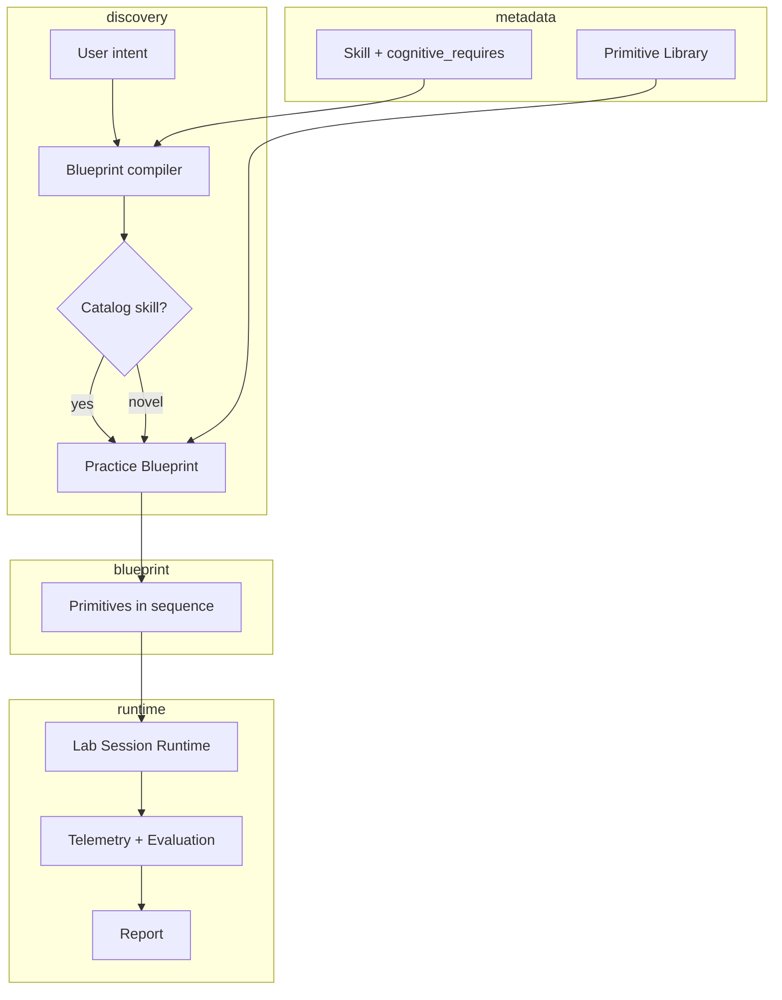
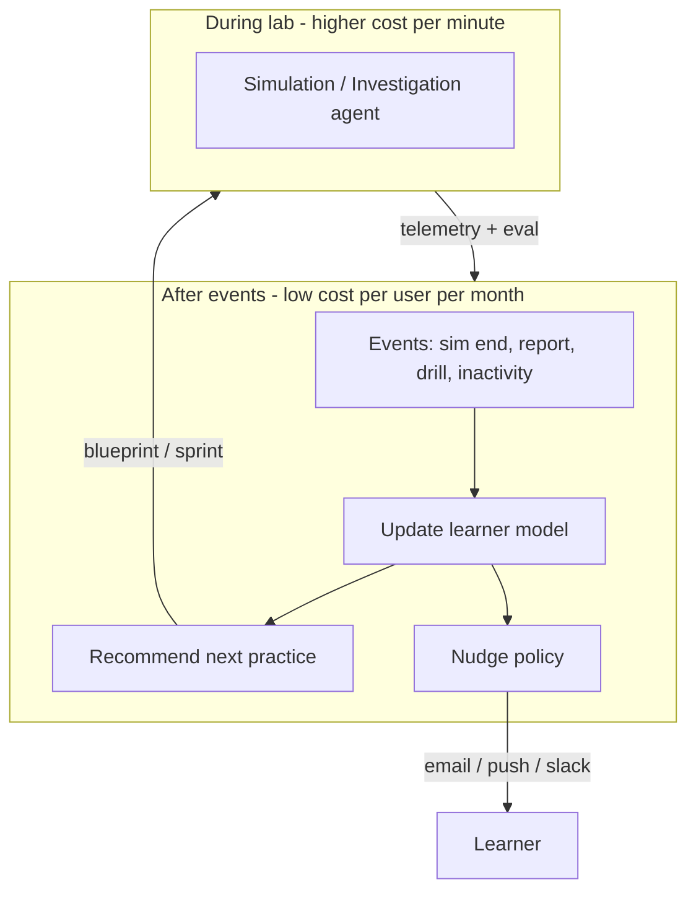
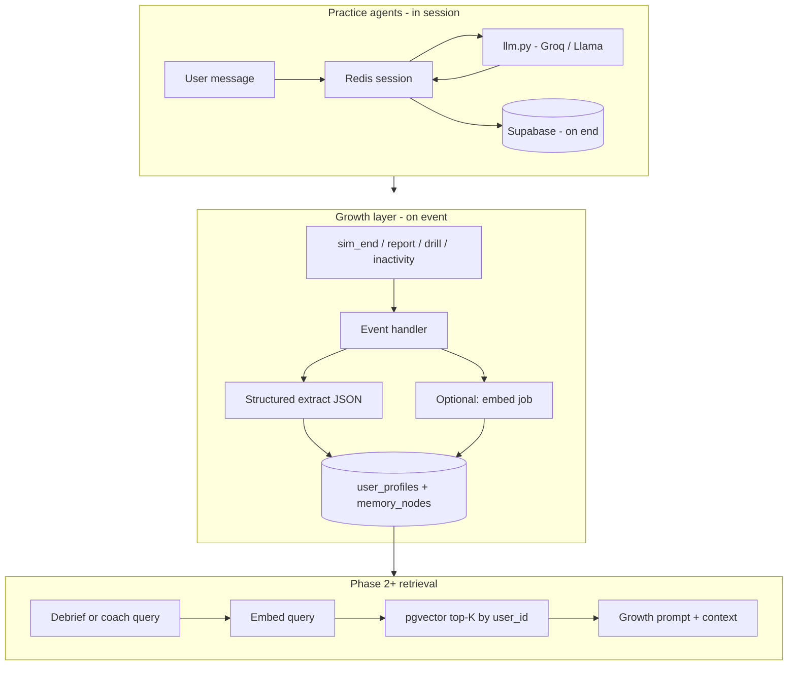

# Lumi6 Skill Lab — Product Direction & Future Plan

This document captures the strategic direction for Lumi6: where the product is today, where it is going, and how the pieces fit together. It consolidates architecture review, the Skill Lab Canvas Engine vision, agent vs non-agent boundaries, and the longitudinal Personal Growth layer.

---

## Executive summary

Lumi6 is evolving in two parallel directions:

1. **Skill Lab Canvas Engine** — Move from fixed stage templates to **composable learning primitives** assembled into practice blueprints (a compiler, not a chat agent).
2. **Human Development Graph** — Build a **longitudinal learner model** updated by practice events, powering recommendations, pathways, and nudges (an event-driven growth system, not content generation).

**Moat hypothesis:** Simulations, content, and AI coaching will commoditize. What is hard to copy is **years of behavioral evidence** about how a specific person learns, fails, improves, and which interventions work for them.

---

## Part 1: Current platform (baseline)

### What exists today

| Layer | Role | Key locations |
|--------|------|----------------|
| Taxonomy | ~15 skills, sub-skills, archetype + session engine | `src/data/skills-taxonomy.ts` |
| Archetype resolver | Maps archetype → stage flow, eval dimensions, prompts | `backend/app/ai/archetypes.py`, `src/types/index.ts` |
| Stage UI | One Next.js route per screen family | `src/app/.../sprint/[id]/(stages)/*` |
| Content AI | Generates primer, drills, scenarios, reasoning, reflection | `backend/app/routers/sprint_content.py` |
| Practice AI | Multi-turn simulation, evaluation, reports | `sprint_simulation.py`, `sprint_evaluation.py` |
| Discovery | “What do you want to learn?” → keyword match | `src/components/dashboard/LearningChatFAB.tsx` |

### Archetypes (Phase 1)

Six archetypes group skills into practice formats:

| Archetype | Session engine | Stage flow (summary) | Status |
|-----------|----------------|----------------------|--------|
| **conversational** | `roleplay_engine` | Primer → drills → guided/independent sim → replay → reflection → escalated → report | **Live** |
| **analytical** | `reasoning_engine` | Primer → drills → reasoning workspace (3 modes) → reflection → assessment → report | **Live** |
| **reflective** | `reflection_engine` | Primer → guided reflection → patterns → growth plan → report | **Live** |
| **creation** | `creation_engine` | Primer → micro-skills → report | Stub |
| **performance** | `performance_engine` | Primer → micro-skills → report | Stub |
| **systems** | `systems_engine` | Primer → micro-skills → report | Stub |

**Design intent:** “100+ skills → 6 archetypes → 6 session engines.” Adding a skill = assign an archetype, not build a new engine.

**Limitation:** Many distinct cognitive skills (bias detection, root cause analysis, prioritization) share the **analytical** archetype and the same reasoning UI. Content varies via AI; **interaction pattern does not.**

### Implemented stage screens

| Screen | Route(s) | Archetypes |
|--------|----------|------------|
| Primer | `primer` | All |
| Micro-skills | `micro-skills` | All |
| Drills | `drills` | Conv., analytical, reflective |
| Guided / independent / escalated simulation | `simulation/*` | Conversational |
| Replay | `replay` | Conversational |
| Reflection | `reflection` | Conv. + analytical |
| Guided reflection | `guided-reflection` | Reflective |
| Reasoning workspace | `reasoning` | Analytical (assumptions, evidence, counterfactual) |
| Assessment | `assessment` | Analytical |
| Report | `report` | All |

The **reasoning page** is the best prototype for composable practice: one route, multiple modes, shared store (`useReasoningStore`), AI challenges per mode.

### Structural debt to address

1. **DB vs frontend mismatch** — Migrations define a fixed 11-stage `stage_type` enum; frontend uses archetype-specific flows. Sprint creation should insert stages from `get_stage_flow(archetype)`.
2. **Dual skill metadata** — DB has `learning_engine_type`; app uses `archetype` + `session_engine` in taxonomy (align via migration).
3. **Sprint identity** — URLs use slugs; context often resolves from taxonomy, not always DB sprint rows.
4. **Stages are pages, not blocks** — New interaction = new route + nav + prompts; not primitives in a lab shell.

### Schema already aligned with the future

- `user_profiles` — Learning genome (personality, strengths, weaknesses, scores) — `002_user_profiles.sql`
- `memory_nodes` — Typed longitudinal insights with embeddings — `007_memory.sql`
- `user_skill_mastery` — Per-skill mastery over time — `004_sprints.sql`

The **tables exist**; the **event pipeline that fills them** is the main gap.

---

## Part 2: Vision — Skill Lab Canvas Engine

### Problem

Today: **Skill → Archetype → Fixed stage pages**

When someone wants bias detection, root cause analysis, product prioritization, systems thinking, or negotiation *planning*, we either force them into the nearest archetype or hand-build flows. **Not scalable.**

### Target

**Skill → Cognitive behaviors required → Best primitive sequence → Assembled practice**

A skill becomes metadata:

```json
{
  "skill": "Bias Detection",
  "requires": [
    "evidence_evaluation",
    "assumption_testing",
    "alternative_hypothesis_generation"
  ]
}
```

A **blueprint compiler** (rules + optional LLM for content) maps requirements to primitives. This is **not** a free-form learning agent.

### Learning primitives (Lego blocks)

| # | Primitive | Purpose | Agent? |
|---|-----------|---------|--------|
| 1 | **Read** | Consume email, proposal, meeting notes, chat, dashboard, report | No — generate artifact once |
| 2 | **Annotate** | Highlight risks, assumptions, biases, contradictions | No — UI + rubric eval |
| 3 | **Categorize** | Drag-and-drop into buckets (fact / assumption / opinion) | No |
| 4 | **Prioritize** | Rank items (e.g. customer requests) | No |
| 5 | **Decision** | Choose strategy + explain why | No |
| 6 | **Canvas** | Whiteboard: sticky notes, links, frameworks | No (MVP); optional AI suggestions later |
| 7 | **Branching scenario** | Choices change scenario state | State machine + content |
| 8 | **Investigation** | User asks questions; system reveals facts gradually | **Yes** |
| 9 | **Simulation** | Multi-turn roleplay (existing engine) | **Yes** |
| 10 | **Artifact** | User creates email, memo, roadmap | No — create + eval |
| 11 | **Review** | Evaluate someone else’s work | No — rubric eval |
| 12 | **Feedback** | Structured debrief | Mostly no; optional Socratic coach |

### Example blueprints

**Bias detection**

```
Read (proposal) → Annotate (biases) → Decision (recommendation) → Feedback
```

**Product prioritization**

```
Read (customer requests) → Prioritize (board) → Artifact (decision memo) → Feedback
```

**Root cause analysis**

```
Read (incident report) → Investigation → Canvas (cause map) → Decision
```

**Negotiation**

```
Read (briefing docs) → Canvas (strategy) → Simulation → Feedback
```

### Target architecture



### Core data model (conceptual)

```typescript
interface SkillDefinition {
  name: string
  archetype: SkillArchetype          // default engine family
  cognitive_requires: string[]
  default_blueprint_id?: string
}

interface PracticeBlueprint {
  id: string
  skill_id?: string
  title: string
  steps: PracticeStep[]
}

interface PracticeStep {
  primitive: PrimitiveType
  config: Record<string, unknown>   // JSON schema per primitive
  content_ref?: string
}

type PrimitiveType =
  | 'read' | 'annotate' | 'categorize' | 'prioritize'
  | 'decision' | 'canvas' | 'branching_scenario' | 'investigation'
  | 'simulation' | 'artifact' | 'review' | 'feedback'
```

**Keep archetypes** as default blueprints per engine family until orchestrator coverage is high.

### Primitive mapping vs today

| Primitive | Closest today | Gap |
|-----------|---------------|-----|
| Read | Primer / drill context strings | No rich document viewer |
| Annotate | — | Not built |
| Prioritize | Drill `decision` type (text only) | No visual board |
| Canvas | `systems` stub | Not built |
| Investigation | — | Not built |
| Simulation | `sprint_simulation.py` | Mature |
| Review | Replay analysis | Limited to conversation |

---

## Part 3: Agents — where they belong (and where they do not)

### Definition (for Lumi6)

**Real agent** = multi-turn loop + session state + next action depends on user input.

**Not an agent** = one LLM call → JSON → UI; rules routing; fixed wizard; blueprint assembly.

### Real agents today

| Use case | Where | Why |
|----------|-------|-----|
| **Roleplay simulation** | `sprint_simulation.py` — start → message → end | Conversation history, character state (`trust_level`, `stress_level`, `escalation_risk`), guided coach hints per turn |

### Borderline / not agents today

| Feature | Notes |
|---------|--------|
| Guided reflection | Per-entry analyze + `follow_up_question`; step-based unless extended to chat loop |
| Reasoning workspace | Fixed modes + submit → eval |
| Primer, drills, content APIs | One-shot generation |
| Learning Guide FAB | Keyword match, no LLM |
| End simulation / report | Batch eval, not conversational |

### Real agents to add (canvas era)

| Use case | Scenario |
|----------|----------|
| **Investigation** | Root cause, consulting, audits — user asks, system reveals from hidden state |
| **Simulation** (as primitive) | Same engine, slotted in blueprints |
| **Deep debrief coach** (optional) | Socratic follow-up after hard steps — not required for v1 |

### Not agents

- Blueprint / path assembly (compiler + recipes)
- Read, annotate, categorize, prioritize, canvas
- Growth layer recommendations (mostly rules + structured memory)
- Nudges (policy + templates; LLM for one personalized line optional)

### Two agent roles (product architecture)



---

## Part 4: Agent & memory tech stack

This section defines **what to run agents on**, and **when semantic memory / embeddings are required**—separate from product “agent” boundaries in Part 3.

### Summary

| Layer | Semantic memory / embeddings? |
|--------|-------------------------------|
| **Simulation / investigation** (practice agents) | **No** for v1 — session transcript + state in Redis/DB |
| **Growth layer** (learner model + recommendations) | **Structured Postgres first**; add embeddings when retrieval at scale is needed |
| **Blueprint / content generation** | **No** — one-shot LLM + JSON schema |
| **“Find similar past moments for this user”** | **Yes** — `memory_nodes.embedding` + pgvector |

**Schema today:** `007_memory.sql` defines pgvector, `memory_nodes`, and `embeddings` (1536-dim). **Backend does not use them yet**—correct to defer until structured memory is wired.

**Rule of thumb:** **Decisions** → structured learner model. **Recall over lots of unstructured text** → embeddings.

---

### 4.1 Practice agents (simulation, investigation)

**Job:** Multi-turn dialogue, hidden facts, reactive session state.

| Piece | Technology | Notes |
|--------|------------|--------|
| LLM | **Groq / OpenAI-compatible** via `backend/app/ai/llm.py` | `multi_turn_completion` for sims; keep one client |
| Hot session state | **Redis** (replace in-memory `_sessions` in `sprint_simulation.py`) | Messages + `trust_level`, `stress_level`, `escalation_risk`, turn count |
| Cold persistence | **Supabase** — `simulations`, simulation attempts | On `end`; transcript for replay/eval |
| Prompt context | Scenario JSON + system prompt | Fits in context window; no RAG required |
| Agent frameworks | **Not required** | FastAPI routes + session dict/state machine are enough |

**Memory model:**

- **Short-term:** rolling message list (truncate or drop after N turns; keep system prompt + scenario).
- **Optional:** rolling **session summary** updated every K turns (one cheap LLM call)—still not vector search.
- **Investigation:** hidden fact sheet in JSON/DB; model decides what to reveal per user question—same stack as simulation.

**Do not use:** pgvector, LangGraph, or separate vector DB for in-session practice.

---

### 4.2 Growth layer (event-driven learner model)

**Job:** On significant events → extract observations → update profile → recommend / nudge → sleep.

| Piece | Technology | Notes |
|--------|------------|--------|
| Orchestration | **FastAPI background tasks** → later **job queue** (Inngest, Celery, Supabase Edge Functions) | One handler per event type |
| LLM | Same **`llm.py`** + **Pydantic** structured output | One call per event, not a chat loop |
| Source of truth | **`user_profiles` JSONB** + **`memory_nodes`** (typed rows, metadata) | Traits, confidence, evidence pointers |
| Recommendations | **Python recipes** + SQL (`user_skill_mastery`) | Rules-first; LLM optional for message copy |
| Nudges | **Policy engine + templates** | Email/SMS/Slack/push; LLM for one personalized sentence only when needed |

**Phase 1 memory (no embeddings):**

```json
{
  "trait": "conflict_avoidance",
  "direction": "confirmed",
  "confidence": 0.72,
  "evidence": "simulation_id / turn range",
  "source_type": "simulation",
  "created_at": "..."
}
```

Recommendations read: profile aggregates + last N structured nodes + mastery table.

**Phase 2 memory (add embeddings when):**

- User history exceeds what fits in a prompt summary
- Debrief needs “similar past situations”
- Manager/org queries over long unstructured evidence (reports, reflections)
- Skill discovery from free-text goals at scale (optional; taxonomy + keywords may suffice first)

---

### 4.3 Semantic memory & embeddings (when to add)

| Use case | Structured JSON only | + Embeddings |
|----------|------------------------|--------------|
| Next drill / skill from mastery | ✅ | Overkill |
| Trait with confidence + evidence | ✅ | Overkill |
| Catalog match (“I want bias training”) | Taxonomy + keywords OK | ✅ at scale |
| Retrieve relevant past sim / reflection moments | Hard without search | ✅ |
| “How has Alex improved on influence?” (narrative evidence) | SQL aggregates | ✅ for rich quotes |
| In-session simulation | ❌ | ❌ |

**Recommended embedding pipeline (Phase 2+):**

| Component | Choice |
|-----------|--------|
| Vector store | **Supabase Postgres + pgvector** (already in `007_memory.sql`) |
| Embedding model | **`text-embedding-3-small`** (OpenAI) or compatible 1536-dim API |
| What to embed | `memory_nodes.content`, report chunks, optional sim summaries (not every turn) |
| Write path | Event handler inserts node → async embed job → update `memory_nodes.embedding` |
| Read path | Supabase RPC: `match_memory_nodes(user_id, query_embedding, limit)` filtered by type/date |
| Avoid initially | Pinecone / Weaviate / second vector DB unless Postgres search bottlenecks |

**Cost control:** Embed **insights and summaries**, not raw full transcripts. One memory node per sprint outcome beats embedding 50 chat turns.

---

### 4.4 End-state architecture



---

### 4.5 What to build when (tech checklist)

| Phase | Infrastructure | Embeddings |
|-------|----------------|------------|
| **Now** | `llm.py`, Redis for sim sessions, Postgres observations (no vectors) | No |
| **Growth v1** | Event handlers, Pydantic observation schema, rules-based recommendations | No |
| **Growth v2** | Async embed on `memory_node` insert, pgvector search RPC | Yes |
| **Scale** | Job queue, learner snapshot table for fast paths without LLM every request | Yes + caching |

**Explicitly avoid (early):**

- Always-on agent process per user
- LangGraph / AutoGen for growth layer (handlers + schemas are simpler)
- Re-summarizing full chat history on every login
- Separate vector database before Supabase pgvector is proven insufficient

---

### 4.6 Blueprint compiler (not an agent)

| Piece | Technology |
|--------|------------|
| Path selection | Rules + `cognitive_requires` recipe table |
| Content fill | One-shot `chat_completion_json` per primitive `config` |
| Skill discovery (optional) | Taxonomy embeddings in Phase 3—not required for MVP |

No session state, no semantic memory for assembly itself.

---

## Part 5: Personal Growth layer (longitudinal moat)

### What it is (and is not)

**Not:** Learning agent that creates courses (content is commoditized).

**Yes:** **Personal growth system** that continuously updates a structured model of the learner.

Every significant interaction updates (with confidence and evidence):

- Knowledge and skills
- Behavior patterns and personality signals
- Motivators, weaknesses, learning style
- Confidence, EQ-related signals, bias tendencies
- Career aspirations (when provided)

Over time: **User Model v1 → v50 → v500** — increasingly accurate for *this* person.

### Why LMS data is weak vs Lumi6

LMS typically knows: course completed, quiz score.

Lumi6 can know (from practice): avoids conflict, strong analytical thinker, learns best via simulation, weak executive presence, high empathy, low assertiveness (with evidence), improves under coaching, etc.

### Event-driven architecture (cost control)

**Bad (expensive):** Agent awake constantly; full history re-summarized every login; daily LLM nudge per user.

**Good (manageable):** Agent wakes only on events:

| Event | Action |
|-------|--------|
| Simulation completed | Extract observations → update model |
| Assessment / report generated | Update traits + skill deltas |
| Drill completed | Light update |
| Manager feedback received | Merge external signal |
| New role assigned | Refresh goals context |
| User inactive N days | Nudge policy only |
| Skill mastery threshold | Unlock / suggest next skill |

Then: **update learner model → decide next action → sleep.**

Estimated growth-layer cost (with structured memory, batched): often **~$0.10–2 / user / month**, vs simulation cost during active practice.

### Layers

1. **Learner memory (structured)** — Traits, patterns, observations, skill history, goals, motivators. Not raw chat as source of truth.
2. **Reasoning layer** — On each event: what did we learn? confidence change? behavior change? what next? (LLM reasons → writes structured observations.)
3. **Recommendation layer** — Next simulation, drill, skill, challenge (rules + profile; LLM optional for copy).
4. **Engagement layer** — Email, SMS, Slack, Teams, push — **mostly policy + templates**; LLM for short personalization only when warranted.

### Self-improvement (correct framing)

The system should **not** rewrite its own prompts or code autonomously.

It should improve the **learner model** and **recommendation policy** with measured outcomes:

- Month 1: suggest negotiation training
- Month 6: negotiation strong; bottleneck is emotional regulation in conflict → recommend different intervention

Track: did intervention X improve trait Y?

### Observation schema (example)

```json
{
  "observations": [
    {
      "trait": "conflict_avoidance",
      "direction": "confirmed",
      "confidence": 0.72,
      "evidence": "sim_abc turns 4-7"
    }
  ],
  "skill_deltas": { "influence_negotiation": 0.08 },
  "recommended_next": {
    "type": "drill",
    "skill": "assertiveness",
    "reason": "..."
  }
}
```

Store in `memory_nodes` / `user_profiles`. Recommendations use **structured profile + top-K memories**, not full transcript replay.

### Privacy and trust

- Clear UX for “what we believe about you”
- Export / delete
- Manager visibility rules
- Avoid locking personality labels from a single session — require multiple evidence sources and confidence scores

---

## Part 6: Phased implementation roadmap

### Phase 0 — Align foundations (2–3 weeks)

| Task | Outcome |
|------|---------|
| Migrate DB: `skills.archetype`, map `learning_engine_type` | Single source of truth |
| Sprint stages = archetype `stage_flow` at create time | DB matches nav |
| Nullable `practice_blueprint_id` on sprint | Forward-compatible |
| Telemetry contract per primitive (design doc) | Enables eval |
| **Redis** for simulation sessions (replace in-memory `_sessions`) | Production-ready practice agents |

### Phase 1 — Primitive library v1 + lab runtime (4–6 weeks)

Build: `read`, `annotate`, `prioritize`, `feedback`

New route: `/sprint/[id]/lab/[sessionId]` renders `PracticeBlueprint` steps.

Pilot blueprints (hand-authored JSON):

- Bias Detection
- Product Prioritization (subset)
- Root Cause Analysis (investigation stub as Q&A first)

**No growth agent required for Phase 1.**

### Phase 2 — Expand primitives (6–8 weeks)

`investigation`, `decision`, `categorize`, `canvas` (MVP), `branching_scenario`, `artifact`, `review`

Wrap simulation as a primitive step; migrate conversational flows gradually.

### Phase 3 — Blueprint compiler (4–6 weeks)

- Upgrade Learning Guide: embeddings + taxonomy + `cognitive_requires`
- Recipe table: behaviors → default primitive sequences
- LLM fills `config` only, constrained by JSON schema
- User confirms path before start

Example recipes:

| `cognitive_requires` | Default sequence |
|----------------------|------------------|
| evidence_evaluation, assumption_testing | read → annotate → decision → feedback |
| prioritization, tradeoff_analysis | read → prioritize → artifact → feedback |
| root_cause, hypothesis_generation | read → investigation → canvas → decision |
| dialogue, pushback | read → simulation → review → feedback |

### Phase 4 — Personal Growth pipeline (parallel / after Phase 1 events exist)

| Step | Build |
|------|--------|
| 1 | Events: `simulation_end`, `report_generated` → observations → profile + `memory_nodes` (**structured, no embeddings**) |
| 2 | Recommendation API — next skill / drill / sprint (rules-first) |
| 3 | Weekly digest email — template + one personalized line |
| 4 | Outcome tracking — intervention effectiveness |
| 5 | Engagement channels (email first; Slack/Teams later) |
| 6 | **Growth v2:** async embed on memory write + pgvector retrieval for debrief / coach (see Part 4) |

### Phase 5 — Scale & governance (ongoing)

- Blueprint versioning and A/B sequences
- Authoring UI for L&D (visual blueprint composer)
- Per-primitive eval rubrics
- Shared content library (reusable artifacts)
- Human Development Graph analytics for orgs

---

## Part 7: Risks and early decisions

| Topic | Recommendation |
|-------|----------------|
| Canvas scope | Sticky-note MVP before full whiteboard (Excalidraw/tldraw) |
| Authoring | JSON blueprints first; visual composer in Phase 5 |
| Eval budget | Rubric + telemetry per primitive; cap LLM eval calls |
| Mobile | Desktop-first for drag-drop and canvas |
| Enterprise | Guardrails on generated scenarios and “internal” documents |
| Naming | “Blueprint compiler” / “Learner Model Service” vs overloaded “AI agent” |
| Vector / memory | Postgres pgvector first; embed summaries not every chat turn |
| Agent frameworks | Handlers + Pydantic before LangGraph unless complexity forces it |

---

## Part 8: Product positioning summary

| Layer | What it is | Moat potential |
|-------|------------|----------------|
| **Primitives + lab runtime** | Composable practice | Medium — UX and library depth |
| **Archetypes + simulation** | Strong conversational practice | Low alone — commoditizing |
| **Blueprint compiler** | Right practice for right skill | Medium — recipes + schemas |
| **Human Development Graph** | Longitudinal learner model | **High** — time + behavioral data + outcome linkage |

**One-line pitch:** Lumi6 is a practice platform with agents where dialogue or discovery *is* the skill, and a longitudinal growth layer that remembers who you are becoming—not an LMS with a chatbot that writes courses.

---

## Appendix: Key file references

| Area | Path |
|------|------|
| Archetype config | `backend/app/ai/archetypes.py` |
| Stage flows (frontend) | `src/types/index.ts` |
| Skills taxonomy | `src/data/skills-taxonomy.ts` |
| Simulation agent | `backend/app/routers/sprint_simulation.py` |
| Content generation | `backend/app/routers/sprint_content.py` |
| User profile schema | `supabase/migrations/002_user_profiles.sql` |
| Memory schema | `supabase/migrations/007_memory.sql` |
| LLM client | `backend/app/ai/llm.py` |
| Reasoning primitive prototype | `src/app/.../reasoning/page.tsx`, `src/stores/useReasoningStore.ts` |

---

*Last updated: May 2026 — includes agent/memory tech stack (practice vs growth, embeddings phased).*
